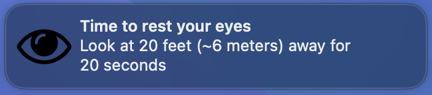

# Twenty-Twenty-Twenty



20-20-20 is a program that alerts every 20 minutes to look something at 20 feet
away for 20 seconds, written in Golang. This is done to reduce eye fadigue [1].
While controversial [2], it is a simple rule to remember and can help long
screen usage sessions.

## How to use

In macOS just run `TwentyTwentyTwenty_<arch>.app`.

> [!WARNING]
> The releases available for macOS are signed with the adhoc certificate. They
> work in my build machine, but I am not sure if they work if downloaded from
> internet to another macOS machine. Of course, you can always build the code
> yourself and it should work.

> [!TIP]
> Configure the notification type in "System Settings" -> "Notifications" ->
> "TwentyTwentyTwenty" to use "Alerts". This will result in the notification to
> stay until the end of the duration period instead of disappearing in a few
> seconds.

In Linux/other OS:

```console
$ ./twenty-twenty-twenty -help
Usage of ./twenty-twenty-twenty:
  -duration uint
    	how long each pause should be in seconds (default 20)
  -frequency uint
    	how often the pause should be in minutes (default 20)
  -sound
    	play notification sound (default true)
  -version
    	print program version and exit
```

## How to build

> [!IMPORTANT]
> For macOS releases, you will need to install Xcode Command-line Tools first
> to sign the application:
> ```console
> $ xcode-select --install
> ```

Needs Go 1.21+.

```console
$ go generate tools.go # install necessary command-line tools
$ go generate
```

If you have `nix` installed, you can also setup the development setup with it:

```console
$ nix develop
```

Or if you have [`nix-direnv`](https://github.com/nix-community/nix-direnv):

```console
$ direnv allow
```

## Credits

[Notification sound](https://bigsoundbank.com/sound-1111-message-1.html) by
Joseph SARDIN - https://bigsoundbank.com.

[1]: https://www.allaboutvision.com/conditions/refractive-errors/what-is-20-20-20-rule/
[2]: https://modernod.com/articles/2023-july-aug/myth-busting-the-202020-rule
